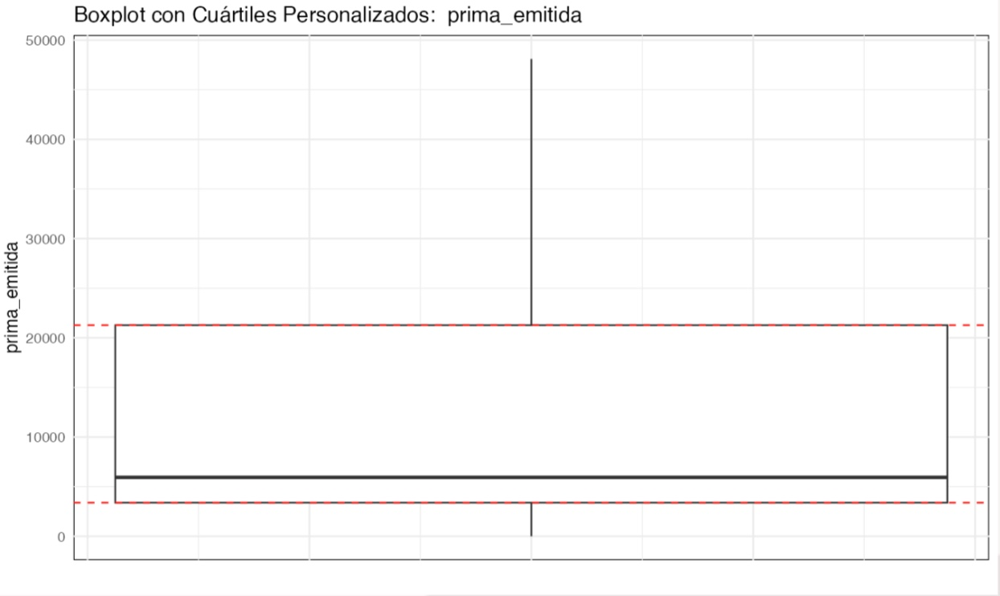
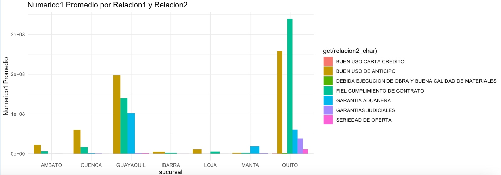
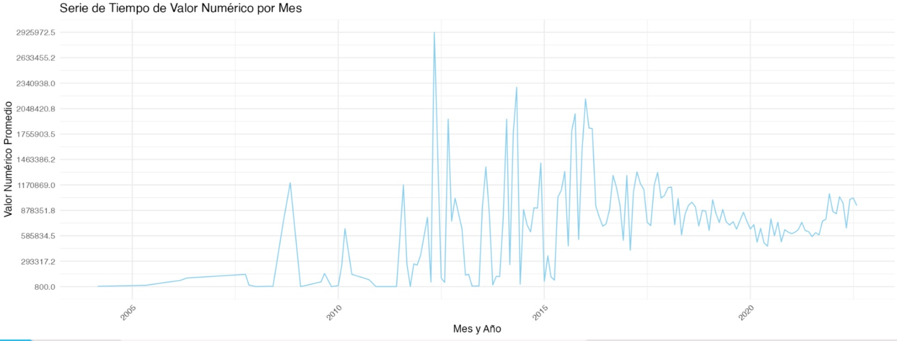
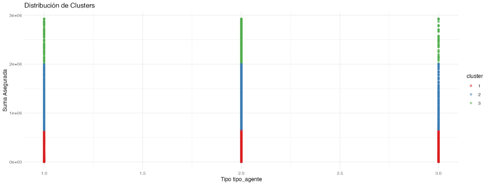

# Introduccion (Enofoque del Analisis)

La aplicación de técnicas avanzadas de análisis de datos como la limpieza de datos, el análisis exploratorio, las series de tiempo y el clustering k-means en el ámbito de las pólizas de seguros es fundamental para desentrañar patrones complejos, tomar decisiones informadas y formular estrategias de negocio efectivas.
Estas técnicas permiten a las aseguradoras no solo cumplir con sus requisitos regulatorios y operativos sino también adaptarse a un mercado cambiante y a las necesidades de los clientes.

Para esto vamos a dar una breve explicacion de los metodos usados y las preguntas o tomas dedecisiones que nos podemos hacer.

## Preprocesamiento de Datos y Manejo de Calidad

##  Exolicacion del metodo:
En la fase inicial del análisis, el enfoque principal fue comprender a profundidad la naturaleza de los datos recopilados. Este proceso implicó una revisión meticulosa para identificar y determinar valores atípicos que podrían sesgar los resultados del análisis. Se aplicaron técnicas estadísticas avanzadas para asegurar una evaluación precisa de estos valores, facilitando una mejor interpretación de los datos y estableciendo una base sólida para los análisis subsiguientes.

### Conclusiones y resultados para toma de decisiones: 
En este caso tomamos el metodo mas comun, usar el rango intercuartilico, sin embargo tenemos algunas opciones para trtar datos atipicos: 
 - Estadistica directa: No hace suposiciones estrictas sobre la distribuciones de los datos 
 - Estadistica Bayesiana: Integra informacion previa con la evidencia actual para decicir el trato de la    variables
 - Metodos Bootstrap: Utiliza re.muestreo
 - Analisis de componentes principales: Reduccion de la dimensionalidad.
Sin embargo hemos aplicado el mas comun, hemos realizado el diagram de caja y bigotes, tanto en los datos originales como en los datos alterados.
Podemos observar que en los datos originales existe una cantidad gigante de valores atipicos la pregunta es que tan importante son estos datos antes de borrarlos o reemplazarlos.

## Análisis Exploratorio en Relación a la Sucursal y el Ramo Comercial

# Explicacion del metodo:
El análisis exploratorio se centró en investigar la relación entre dos variables categóricas: la sucursal y el ramo comercial, así como su interacción con una variable numérica, la prima emitida. Mediante el uso de gráficos de dispersión y pruebas de correlación, se evaluó cómo estas categorías influían en las primas, proporcionando insights valiosos sobre las dinámicas de negocio en diferentes ubicaciones y sectores comerciales.

### Conclusiones e incognitas a primera vista: 
La relacion entre la sucursal y ramo comercial podemos ver que Quito y Guayaquil son las sucursales donde mas (en promedio) firmas de contratos se realizan al menos en dos a tres tipos de ramo comercial, las siguientes preguntas a realizrse son: -¿Y si mañana sucede un antecedente donde exigen el contrato de seguro?
 - ¿Tenemos los fondos suficientes para sustentar ese gasto?
 - ¿Podemos seguir financiando?
 - ¿Por que las sucursales de Quito y Guayaquil son donde mas firman de contratos?
 - ¿Debemos aumentar los empleados en las sucursales de Quito y Guayaquil?
 - ¿Debemso despeddir gente en las demas sucursales?
 - ¿Que estrategia podemos realizar para las demas sucursales?
 - ¿Tenemos fondo para abrir otra sucursal en Quito y Guayaquil?
 - ¿Es necesario abrir otra sucursal?
 - ¿Las sucursales sin tantas firmas de contrato deberiamos cerrarlas?
-¿O estan siendo afectadas por la competencia?
-ETC...

## Evaluación de la Evolución Temporal de las Pólizas.

### Explicacion del metodo:
Se implementó un análisis de series temporales con el objetivo de comprender el comportamiento de los datos a lo largo del tiempo. Este estudio permitió identificar patrones y tendencias estacionales que podrían impactar las decisiones estratégicas de la empresa. Utilizando modelos de series temporales, se analizaron las fluctuaciones en los datos, ayudando a prever cambios futuros y a ajustar las estrategias de negocio acorde a estos hallazgos.

### Conclusiones e incognitas a primera vista: 
Los graficos estan agrupados por meses notemos que la serie o grafica tiene picos y pendientes muy macarcados, las preguntas a realizarnos son las siguientes: -¿Estos picos son en verdad datos atipicos?
 - ¿Que paso en el timpo durante la decaida?
 - ¿A pesar picos podemos ver un aligera tendencia a la alza, factor a relacionar, inseguridad del pais?
 - ¿De investigamos estos picos, fraudes?
 - ¿Por que tenemos picos que crecen de manera constante y decrecen de igual forma?
 - ¿Que tanto lo podemos relacionar con la inseguridad u otros factores?

## Segmentación de Clientes por Tipo de Póliza y Monto Asegurado:

### Explicacion del metodo:

Finalmente, se llevó a cabo un análisis de clustering para segmentar a los clientes según el tipo de póliza y el monto asegurado. Esta segmentación se basó en variables clave como el tipo de persona, el tipo de agente y la suma asegurada. El uso de técnicas de clustering avanzadas permitió identificar grupos homogéneos de clientes, facilitando la implementación de estrategias de marketing y ventas más dirigidas y efectivas.

### Conclusiones: 
Sbemos que el k-means lo que hace es agrupar datos, entonces tenemos un reduccion en la dimension de los datos, es decir, como son agrupados en vez de analizar a cada individuo podemos agruparlos y hacer estudios mas simplificados, por ejemplo, si queremos ver estrategias de marketing tenemos individuos con caracteristicas comunes donde la estrategia de publicidad serviria para todo los de ese cluster.
De igual manera tenemos que nos puede a detectar el fraude, nos referimos a que las desviaciones de patrones pueden ayudar a la deteccion de fraude en caso de serlo.

# Conclusiones generales: 
El breve análisis que hemos realizado ha mejorado nuestra comprensión del mercado, nuestros servicios y nuestros clientes.
Sin embargo, no es suficiente, ya que hemos dejado muchas preguntas sin responder.
Para abordar estas incógnitas, necesitamos llevar a cabo un análisis más profundo y orientado a objetivos específicos.
